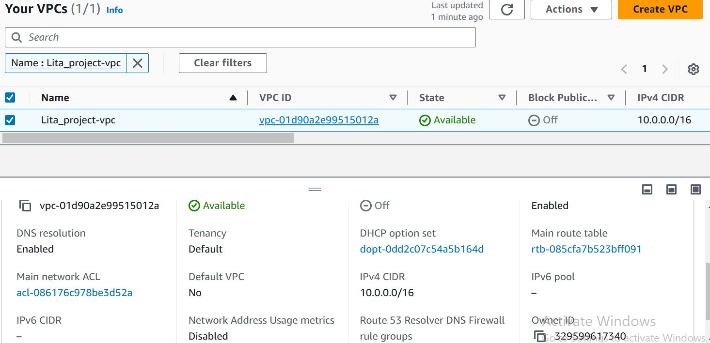
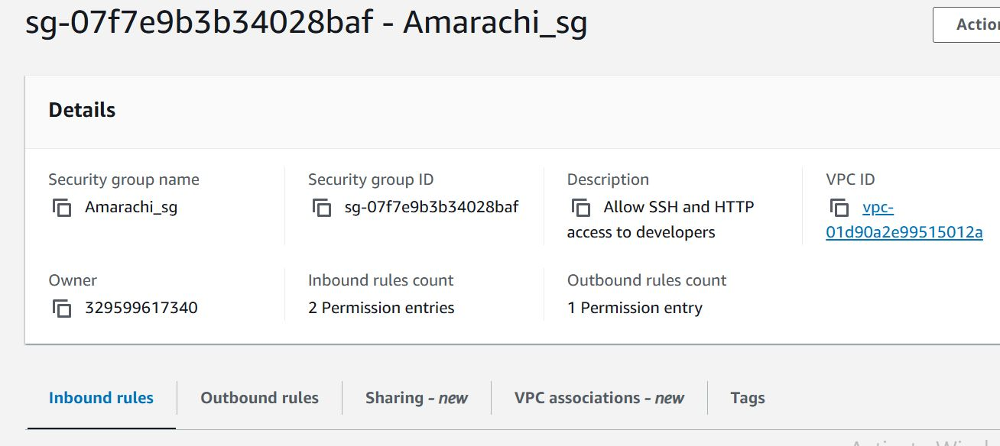
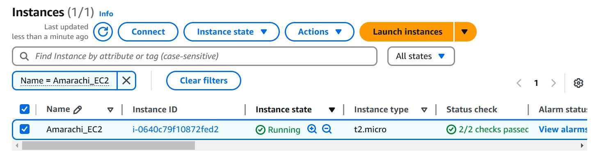
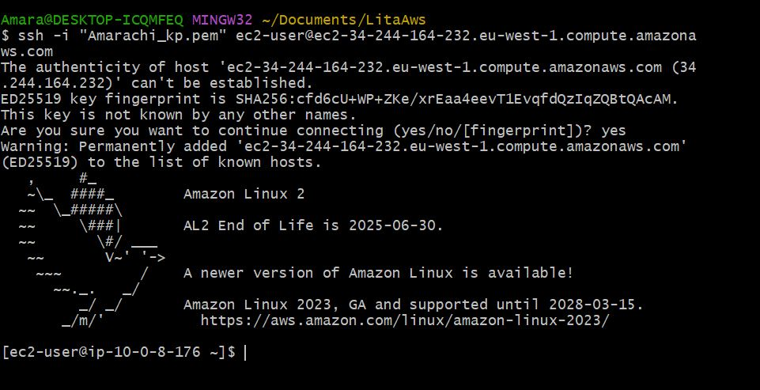
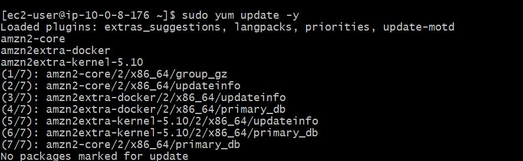
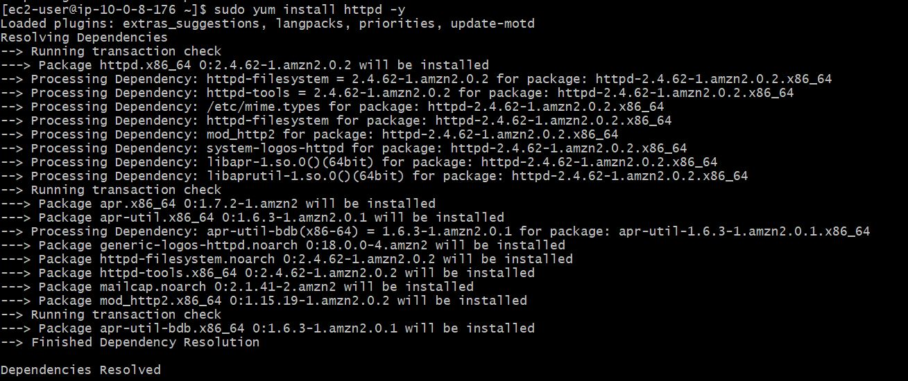
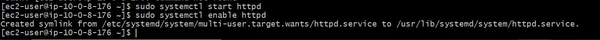
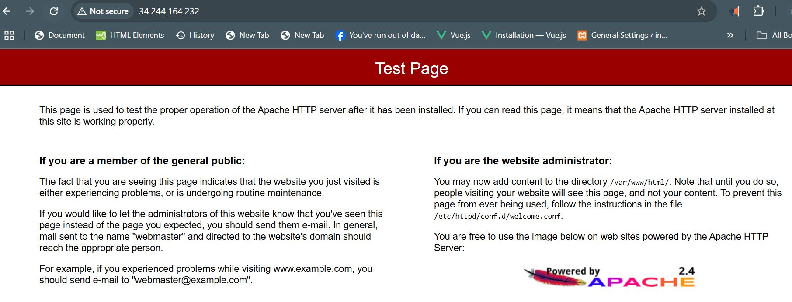

# Custom VPC and EC2 Setup with Apache Web Server

This README outlines the steps to configure a custom Virtual Private Cloud (VPC) on AWS, launch an EC2 instance, and set up an Apache Web Server. 

---

## Overview

This project involves creating and configuring AWS resources to deploy a basic web server. Below are the key components of the setup:

- **Custom VPC**: Segregates your resources into private and public subnets.
- **EC2 Instance**: Hosts the Apache Web Server.
- **Internet Gateway and Routing**: Provides internet access to the public subnet.
- **Security Groups and NACLs**: Implements network-level security.

---

## Steps

### **Part 2: Configure a Custom VPC**

1. **Create a VPC**
   - Navigate to **AWS Console > VPC > Your VPCs > Create VPC**.
   - Configure:
     - **Name**: Your VPC name.
     - **IPv4 CIDR Block**: `10.0.0.0/16`.
   - Click **Create**.

   ## VPC Configuration


2. **Create Subnets**
   - Navigate to **Subnets > Create Subnet**.
   - Configure at least two subnets:
     - **Public Subnet**: CIDR - `10.0.1.0/24`.
     - **Private Subnet**: CIDR - `10.0.2.0/24`.
   - Name them clearly for easy identification.

3. **Add an Internet Gateway**
   - Navigate to **Internet Gateways > Create Internet Gateway**.
   - Attach the gateway to your VPC.
   - Navigate to **Route Tables**:
     - Create a new route table and associate it with the **public subnet**.
     - Add a route:
       - **Destination**: `0.0.0.0/0`.
       - **Target**: Internet Gateway.

4. **Configure Network Access Control List (NACL)**
   - Navigate to **Network ACLs > Create NACL**.
   - Attach it to both public and private subnets.
   - Define rules:
     - Inbound: Allow **HTTP (80)** and **SSH (22)**.
     - Outbound: Allow all traffic.


5. **Set Up Security Groups**
   - Navigate to **Security Groups > Create Security Group**.
   - Configure rules:
     - Inbound:
       - Allow **HTTP (80)** from anywhere.
       - Allow **SSH (22)** from your IP.
     - Attach the security group to the EC2 instance.

## SecurityGroup Configuration

---

### **Part 3: Launch an EC2 Instance with Apache Web Server**

1. **Launch EC2 Instance**
   - Navigate to **EC2 Dashboard > Launch Instance**.
   - Configure:
     - **Name**: `yourfirstandlastname_lita`.
     - **OS**: Amazon Linux 2.
     - **Instance Type**: `t2.micro`.
     - **Network Settings**:
       - Select your custom VPC and **public subnet**.
       - Enable **Auto-assign Public IP**.
       - Attach the created security group.
     - **Storage**: Default to `8 GB`.
   - Create a **Key Pair**:
     - Name the key pair (e.g., `MyKeyPair`).
     - Download the `.pem` file securely.

   - Launch the instance and wait until the status reads **2/2 checks passed**.

   ## EC2 Configuration


2. **Install Apache Web Server**
   - SSH into the EC2 instance using your key pair:
     ```bash
     ssh -i "MyKeyPair.pem" ec2-user@<Public-IP>
     ```
    ## SSH Configuration
    
   - Install and start Apache:
     ```bash
     sudo yum update -y
     sudo yum install httpd -y
     sudo systemctl start httpd
     sudo systemctl enable httpd
     ```

    ## SSHUpdate Configuration
    
    ## SSHInstall Configuration
    
     ## SSHStartEnable Configuration
    

   - Confirm Apache is running:
     - Visit the **public IP address** of the instance in a browser.
    ## Apache Test Page
    
---

## AWS Services Used

| Service             | Purpose                                   |
|---------------------|-------------------------------------------|
| **VPC**             | Isolates resources into a private network.|
| **Subnets**         | Segregates public and private traffic.    |
| **Internet Gateway**| Enables internet connectivity.           |
| **Route Tables**    | Directs traffic within the VPC.           |
| **Security Groups** | Controls instance-level access.          |
| **Network ACLs**    | Adds additional subnet-level security.    |
| **EC2**             | Hosts the web server.                    |

---

